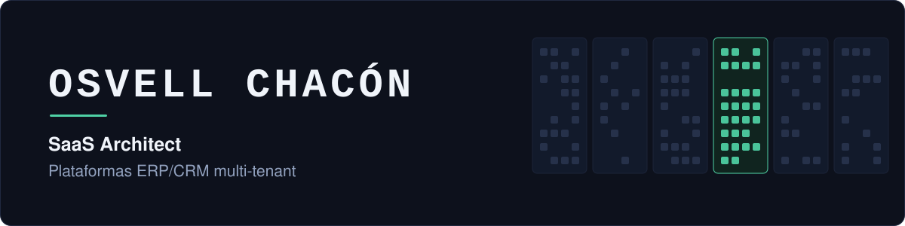

Ing. en Informática · Ing. en Sistemas &nbsp;|&nbsp; Valencia, Venezuela

Diseño y construyo plataformas de gestión empresarial —arquitecturas multi-tenant, ERP/CRM y SaaS propios— desde la arquitectura hasta el despliegue en producción, y dirijo los equipos que las desarrollan.

Mi trabajo se concentra en tres cosas: modelar el aislamiento de datos entre organizaciones sin sacrificar rendimiento, integrar sistemas que no fueron pensados para hablarse entre sí (ERP, telefonía, mensajería, agentes de IA) y automatizar procesos que hoy dependen de trabajo manual.

 

<table>
<tr>
<td align="center" valign="top" width="50%"><h3>165.000</h3></td>
<td align="center" valign="top" width="50%"><h3>6</h3></td>
</tr>
<tr>
<td align="center" valign="top" width="50%">fichas procesadas por un motor de deduplicación propio sobre Odoo 18, con cero pérdida de datos</td>
<td align="center" valign="top" width="50%">organizaciones en piloto sobre ZenithControl, mi plataforma SaaS multi-tenant</td>
</tr>
<tr>
<td align="center" valign="top" width="50%"><h3>+200</h3></td>
<td align="center" valign="top" width="50%"><h3>2</h3></td>
</tr>
<tr>
<td align="center" valign="top" width="50%">estudiantes formados en backend, bases de datos y diseño de APIs</td>
<td align="center" valign="top" width="50%">aplicaciones móviles publicadas en Google Play y App Store</td>
</tr>
</table>

 

## Stack

<table>
<tr>
<td><b>Backend</b></td>
<td>

</td>
</tr>
<tr>
<td><b>Frontend</b></td>
<td>

</td>
</tr>
<tr>
<td><b>Datos e infra</b></td>
<td>

</td>
</tr>
<tr>
<td><b>Plataformas</b></td>
<td>

</td>
</tr>
<tr>
<td><b>Arquitectura</b></td>
<td>SaaS multi-tenant · diseño de APIs · integraciones ERP/CRM · seguridad por organización · CI/CD</td>
</tr>
</table>

 

## Proyectos

<table>
<tr>
<td width="50%" valign="top">

### ZenithControl

Plataforma **ERP/CRM SaaS multi-tenant**: ventas, inventario, contabilidad, RRHH, analítica y auditoría. Producto propio, de la arquitectura al pipeline de CI/CD.

`Django` `React` `PostgreSQL`

</td>
<td width="50%" valign="top">

### InterOceánica

**Motor de deduplicación** sobre un CRM en Odoo 18: fusión de fichas duplicadas con cero pérdida de datos, archivado reversible y tareas programadas sobre 165.000 registros, con ~130 pruebas automatizadas.

`Python` `Odoo 18` `PostgreSQL`

</td>
</tr>
<tr>
<td width="50%" valign="top">

### Obertrack

Plataforma de **seguimiento y gestión de trabajo remoto**, con pizarra dinámica de tareas y flujos de trabajo. Módulos y APIs REST.

`Django` `React`

</td>
<td width="50%" valign="top">

### Afoapp

Gestión de **miembros, pagos y eventos** para una asociación de danza folklórica en Perú. Solución web y móvil liderada end to end, publicada en ambas tiendas.

`Flutter` `Django` `React`

</td>
</tr>
<tr>
<td width="50%" valign="top">

### Prensa Abierta

**Aplicación móvil de prensa** y contenido informativo, desde la arquitectura de la app hasta su integración con los servicios backend. Publicada en ambas tiendas.

`Flutter`

</td>
<td width="50%" valign="top">

### Grow Your Publishing

**Campañas automatizadas de ventas** sobre Amazon Ads, con integración de APIs externas y dashboards de métricas publicitarias en tiempo real.

`Django` `React`

</td>
</tr>
</table>

También: **SICA** — sistema de gestión para una academia de idiomas en España, con automatización de procesos académicos y manejo de datos sensibles (`Django`).

> [!NOTE]
> Buena parte de mi trabajo es privado o está bajo acuerdo de confidencialidad. En los repos marcados como *case study* documento la arquitectura y las decisiones técnicas sin exponer código propietario.

 

## Cómo trabajo

**Prefiero las decisiones reversibles.** Al fusionar 165.000 fichas duplicadas, el diseño archiva los registros absorbidos en lugar de borrarlos: esquiva el borrado en cascada de las relaciones dependientes y deja la operación deshacible. Un error a esa escala no debería ser definitivo.

**Automatizo lo que se repite, y mido lo que cuesta.** La digitalización y carga de expedientes físicos en una oficina donde hice pasantías exigía respetar una estructura de carpetas normativa y tomaba cerca de una semana de trabajo manual por lote. Construí el proceso que hace lo mismo en un clic y en menos de cinco segundos, con el formato exigido intacto. Ese criterio lo apliqué después a varios procesos administrativos de la misma oficina.

**Mantenibilidad antes que entrega rápida.** El código que escribo lo va a heredar alguien más, y normalmente ese alguien no tiene contexto. Diseño pensando en ese momento.

**Lo primero que hago con un sistema heredado es entenderlo.** Recibí un CRM en producción repartido en cuatro repositorios sin documentación; antes de tocar una línea entregué un informe de diagnóstico con los riesgos ordenados por criticidad.

**El criterio se forma en el equipo, no solo en el código.** Rediseñé el proceso de selección técnica de desarrolladores para evaluar criterio de arquitectura en lugar de sintaxis, y definí los estándares de desarrollo del departamento que dirijo.

 

## Formación

- **Ingeniería en Informática** — UPTAIET · incluye TSU en Informática (2022)
- **Ingeniería de Sistemas** — Universidad Politécnica Santiago Mariño · cursada en paralelo
- **Ciberseguridad** — Certificación CISCO
- **Componente Docente** — Formación pedagógica · mentor técnico universitario 2023–2026

 

**Abierto a roles de arquitectura de software y liderazgo técnico.**

